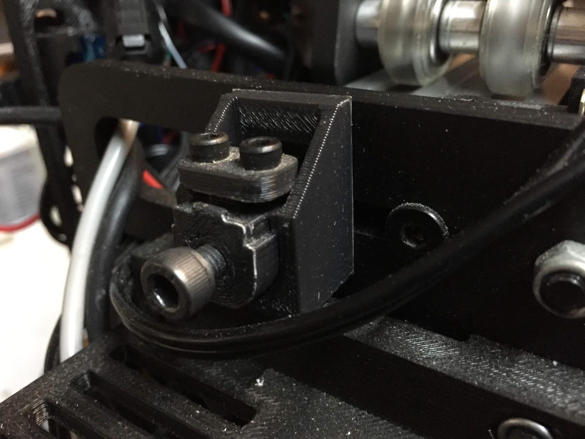
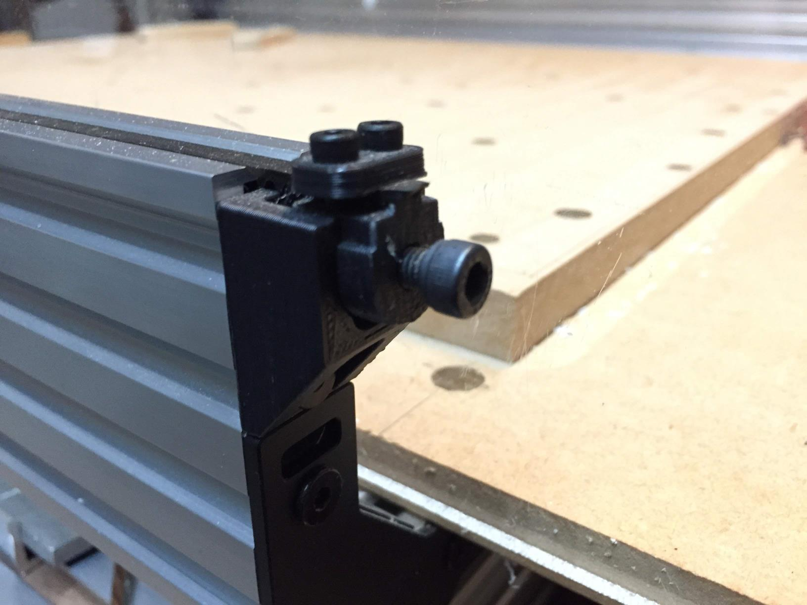

## Belt tensioner

3D printed, based on [Openbuilds OX CNC router Belt Tensioner](https://www.thingiverse.com/thing:1293079). 

The base is attached to the frame with M5 screws using existing holes (on Y gantry plate and on the end of Y extusion). The tensioner part pushes against the head of the screw that holds the base. 