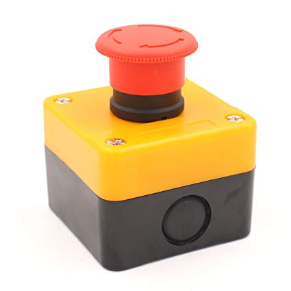

## Emergency stop

I needed it on a few occasions. 

- [eStop-Button-XT60-Insert.stl](./files/eStop-Button-XT60-Insert.stl)
- [eStop-Button-XT60-Insert-Nut.stl](./files/eStop-Button-XT60-Insert-Nut.stl)
- [eStop-Button-XT60-Insert-all-parts.stl](./files/eStop-Button-XT60-Insert-all-parts.stl)