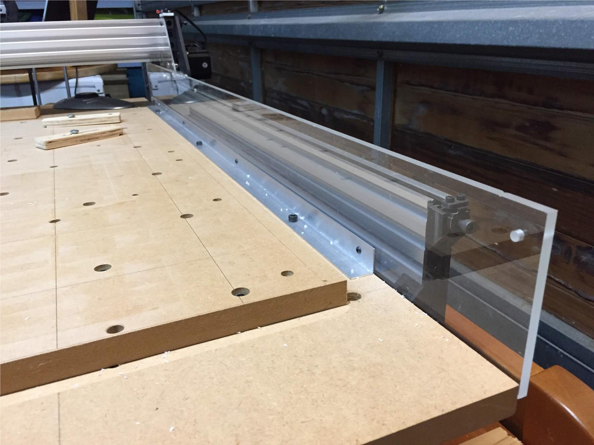

## Fence

Stops the chips flying on to the Y belts and gears. 

I've used a piece of plexiglass and an aluminium angle. Drilled and tapped holes in prexiglass, attached aluminium angle with M3 screws. Added threaded inserts into the base waste board and attache the other side of the aluminium agle to it with M5 screws. 