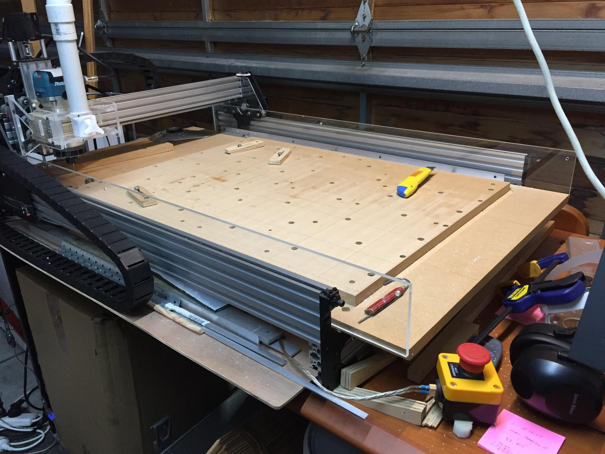

# Ooznest OX CNC.

My mods and addons.

Follow the links for details about each part::

* [Wasteboard](wasteboard.md)
* Limit switches
* [Belt tensioner](belts.md)
* [Emergency stop](e-stop.md)
* [Z-height mod](z-height-mod.md)
* [Dust shoe](dust-shoe.md)
* [Z-Probe](probe.md)
* [Spindle & vacuum control](spindle.md)
* [Clamps](clamps.md)
* [Fence](fence.md)
* Lights
