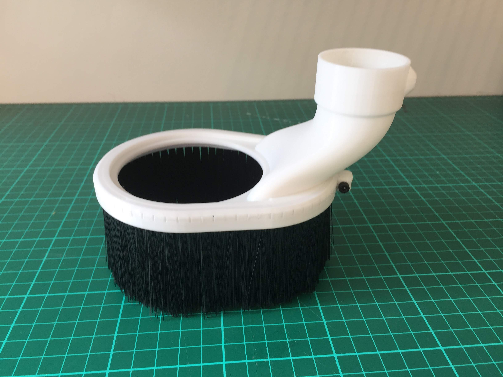

# Ooznes OX CNC.

My addons and customisations.

## Wasteboard
## Limit switches
## Emergency stop
## Z-height mod
## Dust shoe

## Z-Probe
## Spindle control

1. [Customise Makita spindle](https://www.instructables.com/id/Makita-RT0700C-Detachable-Cable-Mod/)

2. Add relay.

## Vacuum control
## Clamps
## Fence
## Lights