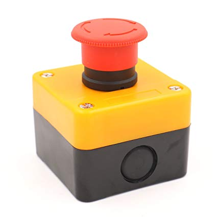

# Ooznest OX CNC.

My mods and addons.

## Wasteboard

M5 nut inserts, spaced 150mm, stagerred so that in the centre of 150x150 square there's a nut.

## Limit switches

They are must have!

## Emergency stop

I needed it on a few occasions. 

- [eStop-Button-XT60-Insert.stl](./files/eStop-Button-XT60-Insert.stl)
- [eStop-Button-XT60-Insert-Nut.stl](./files/eStop-Button-XT60-Insert-Nut.stl)
- [eStop-Button-XT60-Insert-all-parts.stl](./files/eStop-Button-XT60-Insert-all-parts.stl)

## Z-height mod

Swap the bottom two 2040 cross beams and you get 40mm more Z-height!

## Dust shoe

Z-fixed dust shoe with a brush (the white part is 3D printed), clear parts are CNC-ed of acrylic, and some plumbing tubes.

## Z-Probe

Inductive probe controls a relay, which shorts `SCL` (`A5`) and `GND` pins on xPro.

Macro: `G53 G0 G90 Z-3; G28; G21 G91 G38.2 Z-60 F500; G91 G0 Z2 F500; G38.2 Z-2 F10; G92 Z-5.28; G53 G0 G90 Z-3`

Whhat it will do:

1. move to machine top
2. move to probing position
3. rapid move down until probed
4. move up a bit
5. move down slow until probed
6. set 0 offset
7. move to machine top

(Probing positions should be set with `G28.1`

> So the probe is anything that will take pin A5 to ground when it touches your object. The probe position is relative to machine 0. A typical probe command might be `G38.2 X20 Y15 Z-100` (in mm mode). You should set a slow feed rate , e.g. `F20` (20mm/min). The `G38` will move to X and Y, then Z axis will lower to -100 until the probe makes contact with your object, at which time movement stops. Grbl will report the machine position of the probe touch. 

> Connect a small capacitance capacitor (e.g. 471) between the probe wires to avoid false triggers

Important commands: 
* `G28.1` - store current location 
* `G28` - move to remembered location
* `G38.2 F50 Z-5` - move Z -5mm until touched 
* `G92 Z0` - set work coordinate

## Spindle control

1. [Customise Makita spindle](https://www.instructables.com/id/Makita-RT0700C-Detachable-Cable-Mod/)

2. Add relay.

## Vacuum control
## Clamps

## Fence

Stops the chips flying on to the Y belts and gears.

## Lights
