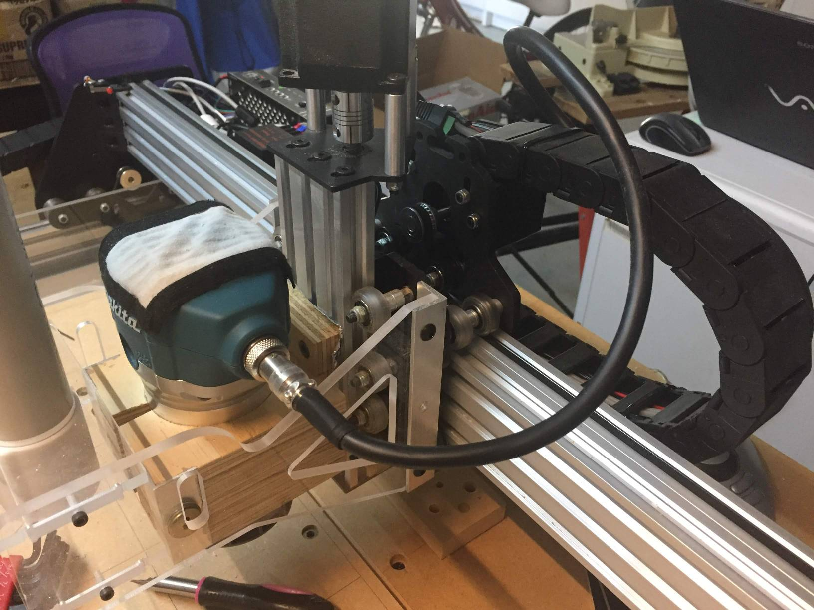
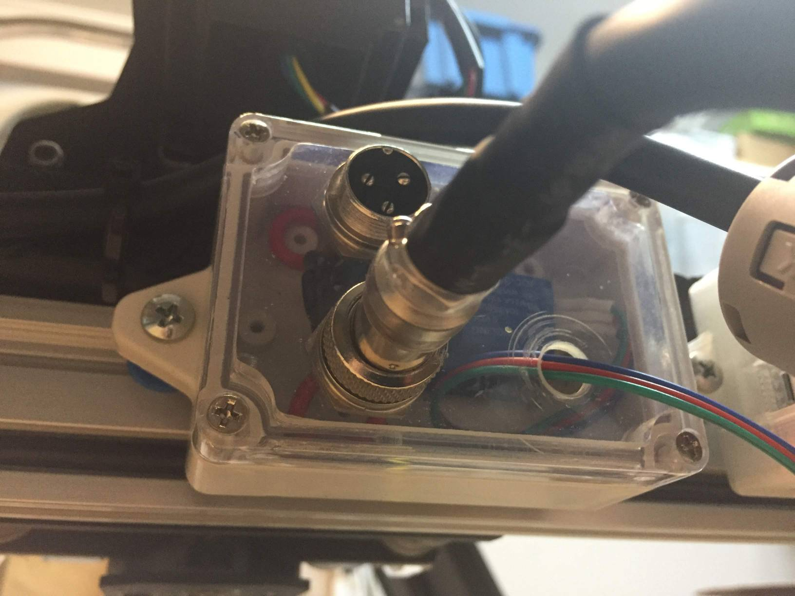
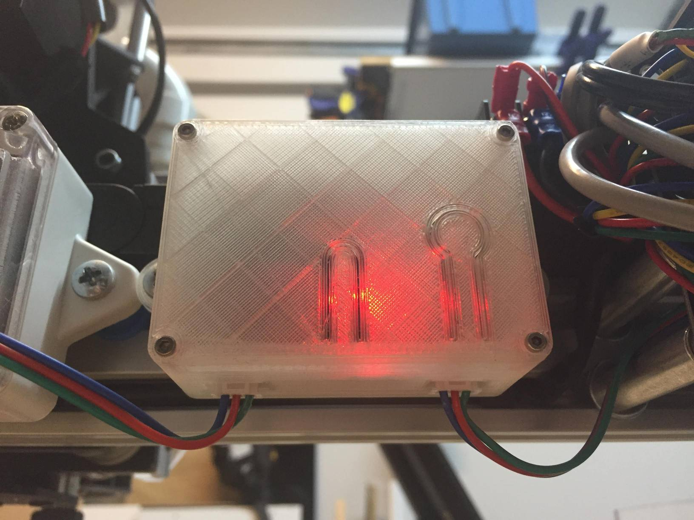
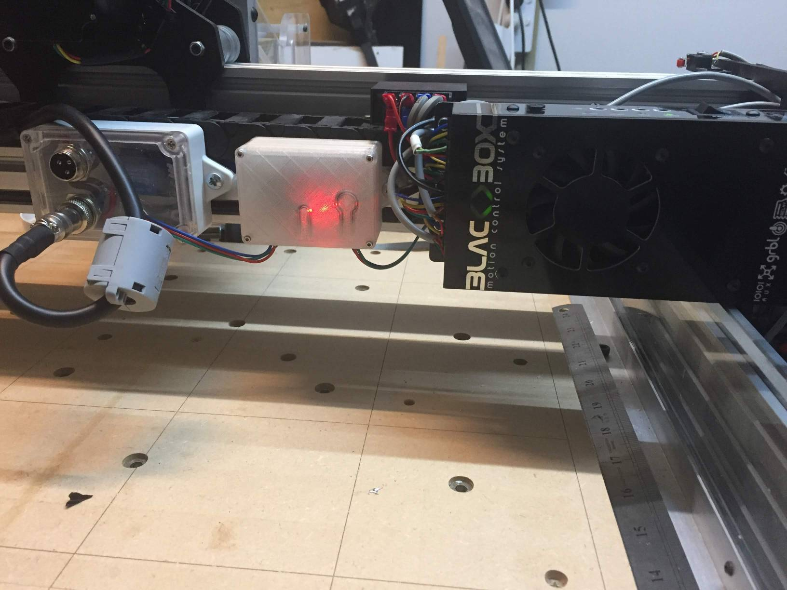
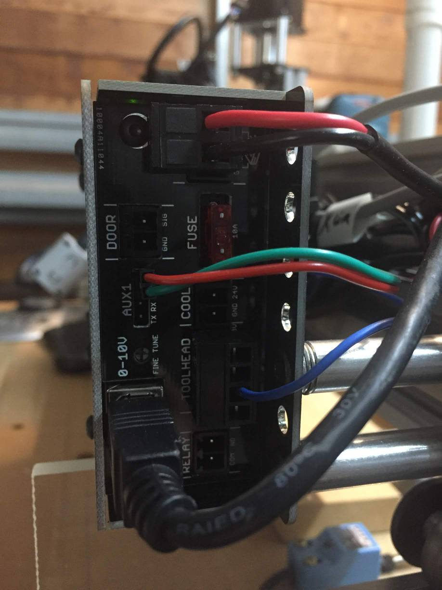

## Spindle control

1. [Customise Makita router](https://www.instructables.com/id/Makita-RT0700C-Detachable-Cable-Mod/) - to be able to detach a cable from the spindle and to easily connect it a relay module.

2. Add spindle control relay.

The mains power goin in (not connected on the photo above) and the controlled power output goes to the spindle.

## Vacuum control

Arduino-based RF controller to wtich on and off a vaccum plugged into a RF controlled power socket. It's connected to the `PWM` pin on the BlackBox so it reacts to `M3`/`M5` G-Code commands.

